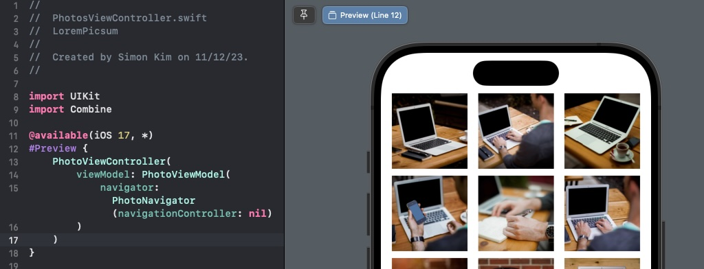

#  Lorem Picsum Photos

A demo app browsing photos on [Lorem Picsum](https://picsum.photos) using its
List Image API
> https://picsum.photos/v2/list?page=2&limit=100

Take a look at the Screen shots of the App


# First View Controller

```swift
// https://developer.apple.com/documentation/uikit/uiapplicationdelegate/1622921-application
// AppDelegate's application(_:didFinishLaunchingWithOptions:)
    let rootScene = PhotoScene()
    let viewController = rootScene.viewController()
    window.rootViewController = viewController
```

## View Controller Scene
A view controller and its associated components such as View Model and Navigator are connected to each other by the corresponding View Controller Scene.
For example, `PhotoScene` is responsible for creating and/or connecting components before presenting `PhotosViewController`.

SwiftUI backed UIHostingController is a UIViewController too. Just because it's a View Controller Scene it doesn't mean it stops you from using SwiftUI views.

```swift
struct PhotoScene {
    func viewController() -> UIViewController {
        let navigationController = UINavigationController()
        let viewModel = PhotoViewModel(
            navigator: PhotoNavigator(navigationController: navigationController)
        )
        let viewController = PhotoViewController(viewModel: viewModel)
        navigationController.pushViewController(viewController, animated: false)
        return navigationController
    }
}
```


## ViewModel
`ViewModel` provides View Controller with Display Content as simple String, UIImage, or even Combine publisher and takes and handles action request such as button tap or transition to a different Scene, View Controller.
This enables unit test setup for ViewModel very straightfoward. No View Controller instances are required. UINavigationController is optional, just creating ViewModel object, sending actions to it, asserting Display Content is enough for testing all the possible use cases.


## Navigator
`Navigator` is responsible for presenting and dismissing the next Scene, FullSizePhotoViewController from PhotosViewController for example. It is also reponsible for dependency forwarding and injection. `FullSizePhotoScene`, for example, has two important dependencies. The selected `Photo`, model object contains author's name, size, as well as download url, is the first, and UINavigationController is the second. `Photo` model directly comes from PhotoViewModel, while UINavigationController comes from `PhotoScene`.
Navigator collects these dependencies from two routes and forwards to `FullSizePhotoScene` so `FullSizePhotoViewController` can easily access these dependencies.

## ViewController
`ViewController` than takes a very passive rendering responsibility, so we can take advantage of Xcode 15's `#Preview` macro. With slight change of defining a protocol for `PhotoViewModel`, we can even plug a mock ViewModel object just as if it were a unit test.

```swift
@available(iOS 17, *)
#Preview {
    PhotoViewController(
        viewModel: PhotoViewModel(
            navigator: PhotoNavigator(navigationController: UINavigationController())
        )
    )
}
```



# Efficient Image loading from Network or File

Downloading and displaying a large number of images from network, or even from file systems or Photos Library can easily cause a performance or memory footprint issue.
Lorem picsum photos are relatively high resolution and it is the similar case for Photo Library photos. Yet we want to start with quickly scrollable low resolution thumbnails.

Typical approaches for this problem is
1. Resize to thumbnail while decoding, not after
2. Discard images downloaded too late for the cell. Cell is now appointed to a new Photo.

[`class PhotoCell`](LoremPicsum/Scenes/PhotosScene/PhotoCell.swift) solves #2
```swift
    func configure(with photo: Photo, getImage: @escaping (Photo, @escaping (UIImage?) -> Void) -> Void) {
        photoId = photo.id
...
        getImage(photo) { [weak self] image in
            guard self?.photoId == photo.id else {
                return
            }
        }
```

The efficient image loading part is handled by [`class CachedImageStore`](LoremPicsum/Reusable/CachedImageStore.swift)
```swift
class CachedImageStore {
    enum Error: Swift.Error {
        case imageLoadingFailed
    }
    func getImage(from url: URL, targetSize: CGSize) async throws -> UIImage
}
```
and it is achieved by using CGImageSourceCreateWithData() and CGImageSourceCreateThumbnailAtIndex() as already addressed by [Matt on NSHipster](https://nshipster.com/image-resizing/) and [Core Image Programming Guide](https://developer.apple.com/library/archive/documentation/GraphicsImaging/Conceptual/CoreImaging/ci_performance/ci_performance.html#//apple_ref/doc/uid/TP30001185-CH10-SW1)

To avoid downloading the same image over and over again, images are internally cached in `NSCache` object.

Here is an example usage,[`PhotoViewModel`](LoremPicsum/Scenes/PhotosScene/PhotoViewModel.swift)
```swift
func getImage(for photo: Photo, targetSize: CGSize, completion: @escaping (UIImage?) -> Void) {
    let dq = DispatchQueue.main
    Task {
        do {
            let image = try await cachedImageStore.getImage(from: photo.downloadUrl, targetSize: targetSize)
            dq.async {
                completion(image)
            }
        } catch {
            photoErrorSubject.send(.imageLoadingFailed)
            dq.async {
                completion(nil)
            }
        }
    }
}
```
# ShortNoticeView

Instead of alerting and stading in the way of App user's workflow, sometimes it is enough to show a gentel reminder for a second or two, or even let the user dismiss it.

```swift
@available(iOS 17, *)
#Preview {
    let view = UIStackView()
    view.axis = .vertical
    view.addArrangedSubview(ShortNotice(.info, message: "Welcome to LremPicsum App", timeout: 20))
    view.addArrangedSubview(ShortNotice(.error, message: "Failed to load image id:10", timeout: 20))
    return view
}
```


Find the code here: [`ShortNotice`](LoremPicsum/Reusable/ShortNotice.swift)
